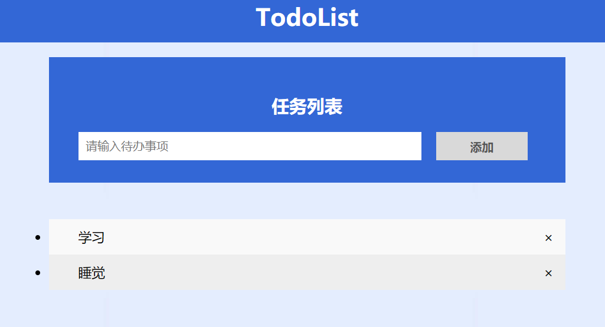

## 1、任务拆分
(1)显示待办事项列表  
(2)添加待办事项  
(3)删除待办事项  
(4)将待办事项状态修改为完成  
## 2、任务分配
杨祥瑞-19030100141-后端  
庄太保-18020100092-测试  
罗兵-18010500134-需求分析及文档  
李飞龙-17030120100-前端  
## 3、代码结构
    finalHomeWork
        |
        |-- backend  // 使用express构建RESTful API和使用supertest的TDD测试
        |
        |-- frontend  // 使用ReactJs构建前端组件
        |
        |-- e2e // 使用Puppeteer进行页面控制，实现端到端测试
        |
        |-- data // 用来存放Task数据
        |
        |-- img // 存放文档图片
        |
        |-- README.md // 文档说明
        
## 4、web应用程序界面

## 5、Task文件格式
[{"task":"学习","id":0},{"id":1,"task":"睡觉"}]
## 6、测试驱动开发
(1)e2e 运行自动化测试  
`npm install`  
`npm run test`  
(2)后端TDD测试  
`npm install`  
`npm test`  
(3)后端启动  
`npm install`  
`npm start`  
(4)前端启动  
`启动后端后点击 main.html`
